### 3.1 Multi-Physics Modeling

MetalX smelting requires an **integrated** understanding of thermal, mass transfer, and electrochemical phenomena. We employ **Partial Differential Equations (PDEs)** to capture these processes.

---

#### 3.1.1 PDE Model Architecture & Goals

| **Model**           | **Equation**                                                                                                                   | **Physical Significance**                                     | **Implementation Goal**                                                | **Related Use Cases** |
|---------------------|-------------------------------------------------------------------------------------------------------------------------------|----------------------------------------------------------------|-------------------------------------------------------------------------|------------------------|
| **Thermal Model**   | $\rho c_p \frac{\partial T}{\partial t} = \nabla \cdot (k \nabla T) + Q_{\text{electrical}}\$  (Fourier’s Law)               | Tracks **temperature fields** in the molten bath and cell walls. High temperature gradients can lead to excessive heat loss, anode wear. | - Identify hot spots or areas for insulation upgrades   - Provide real-time or near-real-time temperature predictions for optimization | UC-02, UC-03           |
| **Mass Transfer**   | $\frac{\partial C_{\text{MetalX}^{n+}}}{\partial t} = \nabla \cdot (D \nabla C_{\text{MetalX}^{n+}}) - R_{\text{electrochemical}}$  (Fick’s Law) | Models **ionic concentration** of MetalX in the electrolyte. Distinguishes between well-mixed and diffusion-limited zones.              | - Optimize bath composition   - Minimize impurities and maximize yield                                                          | UC-02, UC-06           |
| **Electrochemical** | $\ i = i_0 \Big[\exp\big(\frac{\alpha_a F \eta}{RT}\big) - \exp\big(-\frac{\alpha_c F \eta}{RT}\big)\Big]$   (Butler–Volmer) | Captures **electrode kinetics** and current density vs. overpotential relationships.                | - Predict anode effect frequency   - Adjust voltage/current to reduce energy consumption and CO₂ generation                      | UC-02, UC-03, UC-05    |

#### 3.1.2 Boundary Conditions & Domain Considerations

1. **Thermal Boundaries**  
   - **Top Surface**: Typically open to ambient environment or covered by insulating material; modeled with **convective** or **radiative** boundary conditions.  
   - **Side Walls**: Concrete/graphite lining with known **thermal conductivity**; can be partially cooled.  
   - **Bottom**: Insulating layer or water-cooled panels.

2. **Mass Transfer Boundaries**  
   - **Electrode Regions**: Ion flux can be enhanced or diminished by local overpotential.  
   - **Molten Bath Surface**: Possible mass transfer with air or flux additions.  
   - **Inflow/Outflow**: If the smelting line has continuous feed or draw.

3. **Electrochemical Boundaries**  
   - **Anode Boundary**: Overpotential driven by reaction kinetics at the anode.  
   - **Cathode Boundary**: Where metal deposition or side reactions occur.

4. **Domain Geometry**  
   - Often represented in **2D** or **3D** (depending on HPC capacity) with finite element or finite volume discretization.  
   - **Mesh resolution** must be sufficient to capture steep gradients near electrodes.

#### 3.1.3 PDE Solver & Implementation

1. **Frameworks**:  
   - **FEniCS**, **SfePy**, or **OpenFOAM** for PDE discretization and solution.  
   - **Python** integration with **NumPy/SciPy** for data handling and custom routines.

2. **HPC Considerations**:  
   - **Parallelization** using MPI, GPU-accelerated solvers, or cloud-based HPC clusters.  
   - Use case: Real-time or near-real-time PDE solutions may require **coarse-grid** or **reduced-order** models if HPC resources are limited.

3. **Validation & Calibration**:  
   - Compare PDE results with **lab-scale** or **pilot** data.  
   - Conduct **sensitivity analysis** on key parameters (thermal conductivity, diffusion coefficient, reaction rates).

4. **Output Data**:  
   - **Temperature Field**: 2D/3D matrix of T(x,y,z,t).  
   - **Concentration Field**: C(x,y,z,t) for MetalX ions.  
   - **Current Density**: i(x,y,z,t), used for further optimization steps.

---

### 3.2 Optimization Formulation

Building on PDE outputs, we formulate an **optimization problem** to minimize energy consumption while respecting production, quality, and safety constraints.

---

#### 3.2.1 Mathematical Formulation

1. **Objective Function**  
   $\text{Minimize} \quad \int_0^T (V(t) \cdot I(t))\, dt$
    where \(V(t)\) is the applied voltage, \(I(t)\) is current. Alternatively, a **multi-objective** approach can be used:
 

   $\min { E, GHG, \text{AnodeEffects} \}$
    solved via **Pareto front** methods or weighted sums.

2. **Key Constraints**  
   - **Thermal**: $\(T_{\text{min}} \le T(x,y,z,t) \le T_{\text{max}}\)$ to avoid damage to cell lining.  
   - **Production Throughput**: $\(\text{Throughput} \ge \text{TargetRate}\)$.  
   - **Voltage/Current Limits**: $\(V(t) \in [V_{\min}, V_{\max}]\), \(I(t) \in [I_{\min}, I_{\max}]\). $ 
   - **Material Balance**: PDE-based states (concentration, mass flow) must remain feasible.

3. **Variables & Parameters**  
   - **Decision Variables**: Voltage setpoint $\(V\)$, current density \(i\), anode position or insertion timing.  
   - **Parameters**: PDE constants (k, D), cost factors for energy, CO₂ emissions factor, throughput demands.

4. **Solution Methods**  
   - **Nonlinear Programming (NLP)**:  
     - Libraries: **Pyomo**, **CVXPY** with IPOPT, BONMIN, or other solvers.  
     - **Advantages**: Finds local optimum; well-suited if the model is smooth.  
   - **Hybrid Metaheuristics**:  
     - **Genetic Algorithms (GA)**, Particle Swarm Optimization (PSO), etc.  
     - **Advantages**: More robust to non-convex or discontinuous objectives; can handle large solution spaces.  
   - **Reduced-Order Modeling**:  
     - Use simplified PDE or surrogate models (like neural networks) to speed up iterative optimization, especially for near-real-time scenarios.

---

#### 3.2.2 Example Optimization Workflow

Below is a **flow diagram** showcasing how the PDE solutions feed into the optimization routine:

```mermaid
flowchart TD
 subgraph Legend["Legend"]
        X1["🎯 PDE Processing"]
        X2["📊 Data Handling"]
        X3["🛠 Rules & Constraints"]
        X4["⚙ Execution & Optimization"]
        X5["📡 Integration & Results"]
  end
 subgraph PDE_Sim["PDE Model Simulation<br>Thermal, Mass Transfer, Electrochem"]
        A["PDE Model FEniCS / SfePy"]
  end
    A -- 📤 PDE Outputs Temp, Conc, Current --> B["Data Transformation Layer"]
    B -- ✔ Valid Constraints, Boundary Conditions --> C["Optimization Engine<br> Pyomo - NLP/GA/Hybrid"]
    C -- ⚡ Voltage, Current Range, Production Targets --> D["Constraints & Business Rules"]
    D -- 🎯 Optimal Set Points V*, I*, Anode Schedule --> E["Solver Execution & Convergence"]
    B -- 🔄 Aggregated PDE results --> F["Results &amp; Integration<br>with SCADA/Dashboards"]
    F -- 🔍 Constraints & Boundary Conditions --> C
    F -- 🚀 Optimization Outputs --> D
    A -- PDE Outputs<br> Temp, Conc, Current --> B
    B -- Aggregated PDE Results --> C
    C -- Valid constraints<br>Boundary conditions --> D
    D -- Voltage, Current Range,<br>Production Targets --> E
    E -- Optimal Set Points<br> V*, I*, anode schedule --> F
    C -- Constraint Updates --> D
    T["<b>PDE-Based Optimization Workflow</b>"]

     X1:::primary
     X2:::secondary
     X2:::PastelGreen
     X3:::warning
     X3:::Peach
     X4:::danger
     X5:::finalstage
     X5:::Aqua
     A:::primary
     B:::secondary
     B:::PastelGreen
     C:::warning
     C:::Peach
     D:::danger
     E:::finalstage
     E:::Aqua
     F:::primary
     T:::title
     T:::Pine
    classDef title fill:#2C3E50,stroke:#2C3E50,stroke-width:2px,color:#ffffff,font-size:18px,font-weight:bold
    classDef primary fill:#3498DB,stroke:#1F618D,stroke-width:2px,color:white,font-weight:bold
    classDef secondary fill:#2ECC71,stroke:#27AE60,stroke-width:2px,color:white,font-weight:bold
    classDef warning fill:#E67E22,stroke:#D35400,stroke-width:2px,color:white,font-weight:bold
    classDef danger fill:#E74C3C,stroke:#C0392B,stroke-width:2px,color:white,font-weight:bold
    classDef finalStage fill:#9B59B6,stroke:#8E44AD,stroke-width:2px,color:white,font-weight:bold
    classDef subgraphStyle fill:#34495E,stroke:#2C3E50,stroke-width:2px,color:white,font-size:24px,font-weight:bold
    classDef Aqua stroke-width:1px, stroke-dasharray:none, stroke:#46EDC8, fill:#DEFFF8, color:#378E7A
    classDef Peach stroke-width:1px, stroke-dasharray:none, stroke:#FBB35A, fill:#FFEFDB, color:#8F632D
    classDef PastelGreen stroke-width:1px, stroke-dasharray:none, stroke:#82b288, fill:#e2f2df, color:#2e4a3a
    classDef Pine stroke-width:1px, stroke-dasharray:none, stroke:#254336, fill:#27654A, color:#FFFFFF
    style PDE_Sim fill:transparent
    style Legend fill:transparent
```

1. **PDE Model Simulation**: Takes physical properties, initial/boundary conditions, solves for temperature and concentration fields.  
2. **Data Transformation Layer**: Prepares PDE outputs for the optimizer (e.g., average or boundary values, gradient metrics).  
3. **Constraints & Business Rules**: Throughput, safety, maintenance windows, cost factors.  
4. **Optimization Engine**: Iterates to find feasible setpoints that minimize energy while respecting constraints.  
5. **Results**: Pushed to SCADA or dashboards for real-time operational adjustments.

---

### 3.3 Detailed Tables & Requirements

#### 3.3.1 Modeling Requirements (Functional)

| **Feature**                        | **User Story**                                                                                           | **Acceptance Criteria**                                                                                                                 | **Associated Epic** / UC |
|-----------------------------------|----------------------------------------------------------------------------------------------------------|------------------------------------------------------------------------------------------------------------------------------------------|--------------------------|
| PDE Model Integration             | “As a **Data Scientist**,  I need the PDE solver outputs to seamlessly feed into the optimization engine.” | - PDE solver exports temperature & concentration arrays in a standardized format (e.g., HDF5)   - Automated job scheduling on HPC/cluster | EPIC-2 (UC-02)           |
| Multi-Physics Coupling            | “As a **Smelting Engineer**,   I want to couple thermal, mass, and electrochemical phenomena in a single run.” | - Validation test showing < ±5% error from real sensor data   - Coupled solver runs completed in < 60 min for pilot-scale geometry        | EPIC-2 (UC-02)           |
| Model Calibration                 | “As a **PDE Modeler**,   I need to calibrate diffusion, reaction rate constants using lab or historical data.” | - Parameter tuning algorithm integrated   - Documentation of final calibration constants and error metrics                              | EPIC-2 (UC-02)           |
| Real-Time Approximation           | “As a **Plant Manager**,   I need near-real-time PDE insights for rapid decision-making.”                  | - Surrogate model or reduced-order PDE solution < 10s runtime   - Acceptable approximation (±10% error)                                  | EPIC-6 (UC-06)           |

#### 3.3.2 Optimization Requirements (Functional)

| **Feature**                     | **User Story**                                                                                           | **Acceptance Criteria**                                                                                                              | **Associated Epic** / UC |
|--------------------------------|----------------------------------------------------------------------------------------------------------|---------------------------------------------------------------------------------------------------------------------------------------|--------------------------|
| Nonlinear Optimization (NLP)   | “As a **Process Engineer**,   I want to run an NLP that accounts for PDE outputs and operational constraints.” | - Pyomo-based model solves in < 30s for standard problem size   - Yields feasible solutions 90% of test cases                       | EPIC-3 (UC-03)           |
| Multi-Objective Pareto         | “As a **Sustainability Lead**,   I need to balance energy cost vs. GHG emissions vs. anode frequency.”      | - Pareto front generation with at least 3 objectives   - Graphical display of trade-offs on dashboards                             | EPIC-3 (UC-03)           |
| Hybrid GA Approach             | “As a **Data Scientist**,   I need a genetic algorithm solution for large, non-convex scenarios.”           | - GA solver available as fallback for highly non-convex constraints   - Validation with pilot scenario: consistent improvement in at least 70% runs | EPIC-3 (UC-03)           |
| SCADA Integration with Outputs | “As a **Control System Engineer**,    I want the optimized setpoints to feed SCADA in near real-time.”       | - Data pipeline from optimization engine to SCADA < 5s latency   - Overridden if solution is out of safe bounds                    | EPIC-5 (UC-05)           |

#### 3.3.3 Non-Functional Requirements (Modeling & Optimization)

| **Category**          | **Requirement**                                                                                                               | **Acceptance Criteria**                                                                                                                 | **Priority** |
|-----------------------|------------------------------------------------------------------------------------------------------------------------------|-----------------------------------------------------------------------------------------------------------------------------------------|-------------|
| **Performance**       | PDE simulations for pilot geometry must complete within 60 min on HPC; optimization must produce results in < 30s.         | - HPC cluster tests confirm PDE solves within allocated time   - 90% of optimization runs complete under 30s                         | Critical    |
| **Scalability**       | Must handle a **full-scale pot line** with potentially millions of mesh nodes or multiple smelting cells simultaneously.    | - HPC cluster supports up to 2x or 3x expansion   - Architecture tested with expanded domain or concurrent cell simulations          | High        |
| **Accuracy**          | Model predictions within ±5% of measured temperature and ±7% of measured ionic concentration.                               | - Validation run vs. real data from sensors   - Documented verification processes                                                    | Critical    |
| **Robustness**        | Optimization engine must handle partial data loss or PDE solver non-convergence.                                            | - Automatic fallback to default setpoints if PDE or optimization fails   - System logs and alerts triggered                          | High        |
| **Maintainability**   | Model code, optimization scripts, HPC config must be version-controlled, documented, and modular.                           | - Code coverage > 80% in unit tests   - Clear module separation (PDE solver, optimization)                                           | High        |

---

#### 3.4 Implementation Approach & Best Practices

1. **Parallelization**:  
   - Use **MPI** or **multi-threading** for PDE solves; distribute domain across multiple compute nodes.  
   - Possibly integrate **GPU acceleration** for large 3D simulations.

2. **Model Reduction**:  
   - If real-time results are needed, employ **Reduced Order Models (ROM)** or **surrogate neural nets** trained on PDE data.  
   - Example: Train a small DNN to predict temperature fields given boundary conditions, drastically cutting solve time.

3. **Multi-Objective Trade-off**:  
   - Implement interactive **Pareto front** visualization in dashboards, letting managers see the trade-off between energy, CO₂, and throughput.  
   - Provide a weighting mechanism to shift emphasis among objectives (e.g., if carbon taxes rise).

4. **Verification & Validation**:  
   - **Verification**: Check PDE solver correctness via known benchmark problems (e.g., conduction in a simple geometry).  
   - **Validation**: Compare model results to real smelting line data, refining parameters (k, D, reaction rates).

5. **Continuous Integration (CI)**:  
   - Automated testing in **Azure DevOps** pipelines for PDE code, optimization scripts, ensuring quick feedback on merges.  
   - HPC job submission can also be tested in a staging environment.

---

### 3.5 Example Diagrams & Tables

#### 3.5.1 PDE + Optimization High-Level Sequence Diagram

1. Engineer or automated script **submits** PDE job to the **PDE Solver**.  
2. PDE solver runs the **thermal, mass transfer, electrochemical** modules.  
3. The **Optimization Engine** fetches PDE outputs and applies constraints.  
4. The engine **generates** recommended setpoints (voltage, current density).  
5. PDE solver may be updated if iterative approach is used (co-simulation).  
6. Final PDE results + recommended setpoints returned to the engineer.  
7. SCADA system receives the **final commands** for real-time or near real-time control.

#### 3.5.2 HPC Resource Utilization Table (Example)

| **Resource**   | **Requirement**                                        | **Metric/Acceptance**               |
|----------------|--------------------------------------------------------|-------------------------------------|
| CPU Cores      | Up to 128–256 cores for PDE solving per job            | 80%+ utilization sustained          |
| GPUs           | Optional, for accelerated PDE or ML computations       | Reduce runtime by ~50% (target)     |
| Memory         | Large memory nodes (1–2 TB) to handle 3D meshes        | No out-of-memory errors             |
| Storage        | Fast SSD or parallel file system for input/output data | PDE I/O in < 1 min for typical job   |

---

#### Conclusion & Next Steps

By **combining** robust **multi-physics PDE models** (thermal, mass transfer, electrochemical) with **advanced optimization** techniques, Metalworks Inc. can:

1. **Precisely control** the smelting conditions, reducing **energy costs** by up to **10–15%**.  
2. **Lower GHG emissions** by **8–12%**, aligned with sustainability goals.  
3. **Enhance product quality** and reduce anode events via **data-driven** parameters.  
4. **Scale** from pilot to full production lines, leveraging HPC or cloud resources.  
---
