## Table of Contents

1. Objective
    - [1.1 Context](#11-context)
    - [1.2 Project Mission](#12-project-mission)
2. Agile-at-Scale (SAFe) Overview
    - [2.1 Agile-at-Scale (SAFe) Overview](#21-agile-at-scale-safe-overview)
    - [2.2 Use Cases & Value Propositions](#22-use-cases--value-propositions)
    - [2.3 Detailed Requirements](#23-detailed-requirements)
        - [2.3.1 Functional Requirements](#231-functional-requirements)
        - [2.3.2 Non-Functional Requirements](#232-non-functional-requirements)
    - [2.4 Use Case Diagram (Sample)](#24-use-case-diagram-sample)
    - [2.5 Component Diagram (High-Level)](#25-component-diagram-high-level)
    - [2.7 Mentorship & Product Management Community of Practice (CoP)](#27-mentorship--product-management-community-of-practice-cop)
        - [2.7.1 CoP Charter & Goals](#271-cop-charter--goals)
        - [2.7.2 CoP Membership & Roles](#272-cop-membership--roles)
        - [2.7.3 CoP Sessions & Frequency](#273-cop-sessions--frequency)
        - [2.7.4 CoP Success Metrics](#274-cop-success-metrics)
    - [2.8 SAFe Ceremonies, Deliverables & KPIs](#28-safe-ceremonies-deliverables--kpis)
        - [2.8.1 Team-Level Ceremonies (per Sprint)](#281-team-level-ceremonies-per-sprint)
        - [2.8.2 Program-Level (PI) Ceremonies](#282-program-level-pi-ceremonies)
        - [2.8.3 Key Agile Delivery KPIs](#283-key-agile-delivery-kpis)
    - [2.9 Project KPIs & Targets](#29-project-kpis--targets)
    - [2.10 Roadmap](#210-roadmap)
    - [2.11 Stakeholder Engagement & Resource Allocation](#211-stakeholder-engagement--resource-allocation)
    - [2.12 User Experience](#212-user-experience)
    - [2.13 Conclusion & Next Steps](#213-conclusion--next-steps)

  
      
--------------

### 1.1 Context  
Imagine a global industrial giant—call it **Metalworks Inc.**—which smelts a metal (let’s call it **MetalX**) using a highly energy-intensive electrolytic process. This smelting process is a critical step in producing high-grade metals for automotive, aerospace, construction, and consumer goods.

> #### Why This Matters  
> - **Energy Costs**: MetalX smelting is **notoriously energy-hungry**, leading to high operating expenses.  
> - **Environmental Footprint**: Inefficiencies lead to excessive **CO₂ and other greenhouse gas (GHG)** emissions.  
> - **Competitive Pressure**: Global Metalworks Inc. competes with other top smelters and must continuously **improve operational efficiency** to remain profitable.

### 1.2 Project Mission  
- **Digital Transformation to Industry 4.0**: Move from traditional, manual, or purely empirical methods to a robust, **data-driven** approach incorporating **mathematical modeling**, **IoT data**, **advanced analytics**, and **agile delivery**. 
 
**End Goal**: 
- **Cost Competitiveness:** Achieve significant **cost savings** (assume up to **10–15%** energy reduction) through optimized power consumption.
- **Market Differentiation:** Enhanced sustainability credentials for high-grade metals, appealing to environmentally conscious markets.
- **Modular Expansion:** The architecture supports additional smelting lines, new sensor technologies, and advanced ML expansions.

This section details how **Metalworks Inc.** will execute the Industry 4.0 digital transformation journey using **SAFe**, ensuring timely delivery, robust governance, and continuous improvement.

---

### 2.1 Agile-at-Scale (SAFe) Overview

| **Aspect**          | **Description**                                                                                                                   |
|---------------------|-------------------------------------------------------------------------------------------------------------------------------|
| **Framework**       | We adopt **SAFe (Scaled Agile Framework)** for managing multiple agile teams in parallel.                                      |
| **Program Increments (PIs)** | Quarterly cycles (approx. 10–12 weeks each) that package major deliverables or “use cases.”                           |
| **Sprints**         | 2–4 week development cycles within each PI.                                                                                    |
| **Teams**           | Cross-functional squads: Data Engineers, Data Scientists, Smelting Engineers, DevOps, QA, Product Owners.                      |
| **Ceremonies**      | - **PI Planning**: Quarterly event to align on features, capacity, objectives.   - **Sprint Planning**: Bi-weekly/Monthly to break down tasks.   - **Daily Stand-ups**: Synchronize on progress, blockers.   - **Sprint Reviews**: Showcase deliverables to stakeholders.   - **Sprint Retrospectives**: Identify improvements and celebrate successes. |
| **Metrics**         | Velocity (story points), Sprint burndown, Feature completion rate, Flow efficiency.                                            |
| **Tools**           | **Azure DevOps** for backlog, boards, CI/CD pipelines, and KPI dashboards.                                                     |

#### Program Increment Cadence

1. **PI Planning (Week 1):** 
   - Define & prioritize use cases (up to 20) for the quarter.
   - Align on scope, budget, and resource allocation.
   - Identify dependencies and potential risks.

2. **Sprints (Weeks 2–11):** 
   - Execute on features and stories within each use case.
   - Conduct sprint-level ceremonies: planning, daily stand-ups, review, retrospective.
   - Track progress in Azure DevOps (or similar tool).

3. **PI Review & Retrospective (Week 12):** 
   - Present accomplishments, measure KPIs against targets.
   - Gather feedback from stakeholders.
   - Adjust roadmap for next PI based on learnings.

---

### 2.2 Use Cases & Value Propositions
We will focus on **6 key use cases** that are the highest priority and have the most significant impact on achieving the **Industry 4.0** transformation in MetalX smelting. Each use case is tied to specific **business objectives**, **stakeholders**, **functional scope**, and **KPIs**.

| **Use Case ID** | **Use Case Name**                | **PI Target** | **Detailed Description**                                                                                                                                                                   | **Value Proposition / KPIs**                                                                                                                                  | **Priority** | **Business Sponsor**   | **Dependencies**                                     | **Constraints**                                                                                                                                                             | **Risks**                                                                                   |
|-----------------|----------------------------------|--------------|---------------------------------------------------------------------------------------------------------------------------------------------------------------------------------------------|---------------------------------------------------------------------------------------------------------------------------------------------------------------------------------------------------|--------------|------------------------|-------------------------------------------------------|--------------------------------------------------------------------------------------------------------------------------------------------------------------------------------------------------------------------|--------------------------------------------------------------------------------------------|
| UC-01           | Data Ingestion & ETL             | PI #1        | **Establish a robust pipeline** for collecting real-time data from smelting cells (voltages, currents, bath temperatures, anode position) into a centralized Data Lake (or Lakehouse).                                            | - Creates single source of truth for advanced analytics   - **KPI**: 100% of relevant sensors connected   - **KPI**: Max 2% data loss/outages                                            | High         | VP of Operations       | - Sensor upgrade (new or replacements)   - Network stability                         | - High network reliability required   - Must integrate with existing SCADA systems   - Potential sensor calibration challenges                                                                               | - Sensor supply chain   - Network security vulnerabilities                                |
| UC-02           | PDE Model Validation             | PI #2        | **Develop and validate multi-physics PDE models** (Fourier’s Law for heat, Fick’s Law for mass, Butler–Volmer for electrochemical). Integrate with HPC or cloud-based compute for rapid iteration and parameter tuning.           | - Identify optimal smelting temperature ranges   - Reduce impurities in MetalX   - **KPI**: PDE model accuracy ± 5% of real-world measurements   - **KPI**: Model run time < 30 min   | High         | Chief Technology Officer (CTO) | - Clean data availability from UC-01   - HPC cluster readiness                   | - Must ensure PDE assumptions match real chemical/electrical properties   - Skilled PDE modelers required                                                                                                         | - Model complexity leading to high run times   - Domain knowledge gaps                   |
| UC-03           | Optimization Engine Integration  | PI #3        | **Leverage PDE outputs** plus real-time constraints (e.g., throughput, temperature limits) to run optimization algorithms (Pyomo/CVXPY) that minimize energy consumption while meeting production and quality constraints.         | - Up to 10–15% reduction in energy usage   - 8–12% reduction in GHG   - **KPI**: Output recommended set points within 30 seconds   - **KPI**: Maintain throughput at ±2% of baseline | High         | Director of Engineering | - Valid PDE model from UC-02   - ETL pipeline & HPC environment                   | - Must not exceed safety thresholds or equipment ratings   - Real-time responsiveness critical                                                                                                                   | - Inaccurate PDE models = suboptimal results   - High HPC compute costs                  |
| UC-04           | Operational Decision Dashboards  | PI #4        | **Create advanced dashboards** (Plotly/Dash/Power BI) for plant managers to visualize smelting KPIs (energy usage, GHG, anode events). Provide near real-time alerts and trending analytics for proactive decision-making.         | - Faster reaction to anomalies   - Reduce unplanned downtime   - **KPI**: 90% of operators regularly use dashboards   - **KPI**: 25% reduction in anode events                        | Medium       | Plant Manager          | - Consolidated data from UC-01   - Partially integrated optimization (UC-03)       | - Must have user-friendly interface   - Mobile or web-based accessibility                                                                                                                                        | - Low user adoption if UI is not intuitive   - Potential performance issues w/ real-time |
| UC-05           | SCADA Integration for Real-Time Control | PI #5        | **Integrate optimization outputs** with existing SCADA systems to allow near real-time parameter adjustments (voltage, current density) directly on the production line, with safety and override checks in place.               | - Further energy savings   - Reduced labor & manual interventions   - **KPI**: 50% automated control adoption within 3 months   - **KPI**: Tuning latency < 5 seconds               | Medium       | Production Supervisor  | - Full solution from UC-03   - Safety system checks   - SCADA vendor collaboration | - Must maintain fail-safe mode   - Strict regulatory or safety constraints around automated control                                                                                                              | - Hardware compatibility with SCADA   - Resistance from line operators                   |
| UC-06           | Digital Twin & ML Anomaly Detection | PI #6        | **Build a digital twin** environment that mirrors real-time smelting operations. Layer in ML models (LSTM, RNN) to detect anomalies (e.g., unexpected temperature spikes) and predict potential issues before they escalate.       | - Predictive maintenance   - Identify early-stage anomalies for proactive repairs   - **KPI**: 80% accuracy on anomaly detection   - **KPI**: 15% reduction in unplanned downtime   | Medium       | R&D Director           | - Baseline PDE model and data from UC-02, UC-03   - Historical data from UC-01      | - Requires robust real-time data feed   - ML models need large historical datasets                                                                                                                             | - Data quality issues hamper ML   - Potential overfitting or false positives             |

> [!NOTE]
>- Each use case is mapped to a **Program Increment (PI)**, **stakeholder sponsor**, **dependencies**, **constraints**, **risks**, and **KPIs**.
>- Actual scheduling and scope may shift based on **Agile** (SAFe) ceremonies and evolving business needs.

---

### 2.3 Detailed Requirements

#### 2.3.1 Functional Requirements

| **Epic / Feature**      | **User Story ID** | **User Story**                                                                                                                                   | **Acceptance Criteria**                                                                                                                                                                                             | **Associated Use Case(s)** | **Priority** |
|-------------------------|-------------------|--------------------------------------------------------------------------------------------------------------------------------------------------|----------------------------------------------------------------------------------------------------------------------------------------------------------------------------------------------------------------------|----------------------------|-------------|
| **EPIC-1: Data Ingestion & ETL** | US-1.1         | “As a **Data Engineer**,  I want to collect sensor data from smelting lines in near real-time  so that I can provide a unified data source for analytics.”                                 | - ETL pipeline ingests data from X sensors with < 5s latency   - 99% uptime for data ingestion   - Test with at least 3 smelting lines                                                                        | UC-01                       | High        |
|                         | US-1.2         | “As a **Data Scientist**,  I need to preprocess data (clean, validate, transform)  so that PDE models receive accurate inputs.”                                                            | - Outliers flagged & replaced or removed   - Missing data identified and backfilled via domain-approved techniques   - Data versioning in data lake (bronze → silver → gold)                                  | UC-01                       | High        |
| **EPIC-2: PDE Model Development** | US-2.1         | “As a **Smelting Engineer**,  I need a validated PDE model for heat transfer to understand thermal gradients in the cell.”                                                                  | - Fourier’s Law PDE implemented & tested   - Temperature distribution predictions within ±5% of actual measured data   - Document assumptions in the model                                                    | UC-02                       | High        |
|                         | US-2.2         | “As a **Data Scientist**,  I want to incorporate mass transfer (Fick’s Law) and electrochemical (Butler–Volmer)  so that the model captures all relevant phenomena.”                       | - PDE model includes mass transfer and electrochemical kinetics   - Successfully calibrated with lab data   - Stress test model for edge cases (extreme temperatures, voltage swings)                          | UC-02                       | High        |
| **EPIC-3: Optimization Engine** | US-3.1         | “As a **Process Engineer**,  I want to input PDE model outputs and real-time constraints into an optimization framework to minimize energy usage.”                                         | - Pyomo/CVXPY solution returning recommended parameters in < 30s   - Achieve stable solutions for at least 80% of test runs   - GUI or CLI interface for setting optimization constraints                      | UC-03                       | High        |
|                         | US-3.2         | “As a **Production Manager**,  I need to ensure the optimization respects production throughput and quality constraints.”                                                                 | - Constraints ensure throughput variance ≤ 2%   - Quality thresholds maintained (e.g., impurity < X%)   - Automatic fallback if no feasible solution within constraints                                       | UC-03                       | High        |
| **EPIC-4: Operational Dashboards** | US-4.1         | “As a **Plant Manager**,  I want a single dashboard to monitor real-time KPIs such as energy usage, anode events, and GHG emissions.”                                                      | - Dashboard updates every 5 seconds   - Clear visual indicators for threshold breaches   - Role-based access control (Operator, Manager, Executive)                                                           | UC-04                       | Medium      |
|                         | US-4.2         | “As an **Operations Team Lead**,  I want customizable alerts so that I can be notified if anode frequency is above normal or if energy spikes occur.”                                     | - Email/SMS/Push notifications configured   - Thresholds can be set or updated by the user   - Alert accuracy validated with historical data                                                                | UC-04                       | Medium      |
| **EPIC-5: SCADA Integration** | US-5.1         | “As a **Control System Engineer**,  I want to feed the optimized parameters from the engine into SCADA in near real-time.”                                                                | - Data flow from optimization engine to SCADA < 2s   - Override controls for safety   - Logged changes for audit                                                                                               | UC-05                       | Medium      |
|                         | US-5.2         | “As a **Production Supervisor**,  I want to revert to manual mode quickly in case of system anomalies or suspicious recommendations.”                                                     | - Manual override possible within 5s   - Audit log of all overrides   - Automatic alerts to engineering teams when override is triggered                                                                      | UC-05                       | Medium      |
| **EPIC-6: Digital Twin & ML** | US-6.1         | “As an **R&D Engineer**,  I need a digital twin that mirrors real-time smelting operations to run ‘what-if’ scenarios safely.”                                                             | - Digital twin instance updated in real time   - HPC or cloud-based simulation environment available   - Match real system performance within ±5% for standard operating conditions                           | UC-06                       | Medium      |
|                         | US-6.2         | “As a **Maintenance Engineer**,  I want an ML anomaly detection system to predict potential failures, so downtime can be minimized.”                                                      | - ML model (LSTM, RNN, or other) integrated   - 80% accurate in detecting known anomalies   - Generate maintenance tickets automatically when anomalies exceed confidence threshold                           | UC-06                       | Medium      |

#### 2.3.2 Non-Functional Requirements

| **NFR Category**  | **Epic/Feature**                 | **Requirement / Task**                                                                                                                                                 | **Acceptance Criteria**                                                                                                                       | **Associated Use Case(s)** | **Priority** |
|-------------------|----------------------------------|------------------------------------------------------------------------------------------------------------------------------------------------------------------------|--------------------------------------------------------------------------------------------------------------------------------------------------------------------------------------|----------------------------|-------------|
| **Performance**   | EPIC-1 Data Ingestion            | “System must handle data from ~50,000 sensor points/minute with <5s ingestion latency.”                                                                                 | - End-to-end pipeline tested at peak load (50k data points/minute)   - 95th percentile ingestion latency ≤ 5s                                                                    | UC-01                       | Critical    |
|                   | EPIC-3 Optimization Engine       | “Optimization must produce recommended set points in <30s for near real-time usage.”                                                                                    | - Under nominal load, 90% of optimization runs finish in ≤ 30s   - Stress test with 2x baseline data volume to ensure 80% runs ≤ 60s                                             | UC-03, UC-05                | High        |
| **Reliability**   | EPIC-1, EPIC-2                   | “System must maintain 99.9% availability for data ingestion and PDE model access.”                                                                                     | - Monitoring in place for downtime   - Failover strategy documented and tested                                                                                                  | UC-01, UC-02                | High        |
| **Scalability**   | EPIC-6 Digital Twin & ML         | “Must scale horizontally to accommodate future expansions (additional sensors, more computationally intensive PDE/ML).”                                                 | - Cloud/HPC clusters can be scaled up/down automatically   - Architecture tested with 2x sensor load                                                                            | UC-06                       | Medium      |
| **Security**      | All EPICs                        | “All data in transit and at rest must be encrypted. Role-based access must be enforced for dashboards and control systems.”                                             | - TLS 1.2+ for data in transit   - AES-256 for data at rest   - RBAC configured for at least 3 roles (Operator, Engineer, Manager)                                            | UC-01–UC-06                 | Critical    |
| **Maintainability** | EPIC-1 – EPIC-6               | “CI/CD pipeline must be fully automated, with unit tests, integration tests, and code quality checks before merge.”                                                    | - Each code commit triggers automated build & test   - Code coverage > 80%   - Containerization approach (Docker/Kubernetes) for microservices                               | UC-01–UC-06                 | High        |
| **Compliance**    | EPIC-5 SCADA Integration         | “All updates to SCADA must comply with local safety regulations and internal audits. Must keep logs for at least 2 years.”                                              | - Logged changes have timestamps, user IDs   - Data retention verified for 2 years   - Audit reports generated monthly                                                       | UC-05                       | High        |
| **Usability**     | EPIC-4 Dashboards                | “Dashboards must be intuitive, with user-friendly visualization and minimal training required. Accessible from mobile and desktop.”                                     | - 80% positive usability rating in pilot survey   - Simple web-based interface supporting responsive design                                                                     | UC-04                       | Medium      |
| **Interoperability** | EPIC-1, EPIC-5               | “API architecture must allow other plants and 3rd-party systems (including SCADA vendors) to integrate seamlessly.”                                                     | - RESTful APIs with clear docs   - At least one standard integration test suite for 3rd-party SCADA or MES (Manufacturing Execution System)                                     | UC-01, UC-05                | Medium      |

---

### 2.4 Use Case Diagram (Sample)

A simplified **Use Case Diagram** for the “Data Ingestion & Optimization” flow might look like that shows multiple **actors** (Engineer, Plant Manager, Control System, etc.)and how they interact with the **system components** (Data Ingestion, PDE Models, Optimization, Dashboards, SCADA, ML/Anomaly Detection).:

```mermaid
flowchart TD
    A["👨‍💼 PLANT MANAGER"] -- "Views real-time dashboards, & Sets Thresholds" --> B["📊 Operational Dashboards<br> (UC-04) <br> (Views real-time data, sets thresholds)"]
    B -- Requests PDE results & Optimization outputs --> D["🧮 PDE Models<br>(UC-02) <br> (Fourier, Fick, Butler–Volmer)"]
    C["📥 Data Ingestion<br> (UC-01) <br> (Collect, Clean, Store, ETL)"] -- Clean & Store Data --> D
    D -- Model Results --> E["🧠 Optimization Engine<br>(UC-03) <br> (Optimized setpoints)"]
    E -- Optimized Setpoints --> F["🔗 SCADA Integration<br>(UC-05) <br> (Real-time control adjustments)"]
    F -- System Feedback Loop --> G["🖥️ Digital Twin / ML<br> (UC-06) <br> (Anomaly Detection, R&amp;D)"]
    G -- Anomaly Detection & Insights --> B
    
     A:::actor
     A:::actor
     B:::dashboard
     B:::dashboard
     D:::process
     D:::process
     C:::data
     C:::data
     E:::optimization
     E:::optimization
     F:::scada
     F:::scada
     G:::ml
     G:::ml
    classDef title fill:#2C3E50,stroke:#2C3E50,stroke-width:2px,color:white,font-size:18px
    classDef actor fill:#3498DB,stroke:#1F618D,stroke-width:2px,color:white
    classDef dashboard fill:#27AE60,stroke:#1F8E4D,stroke-width:2px,color:white
    classDef data fill:#F39C12,stroke:#D68910,stroke-width:2px,color:white
    classDef process fill:#E67E22,stroke:#D35400,stroke-width:2px,color:white
    classDef optimization fill:#9B59B6,stroke:#8E44AD,stroke-width:2px,color:white
    classDef scada fill:#2980B9,stroke:#1F618D,stroke-width:2px,color:white
    classDef ml fill:#8E44AD,stroke:#6C3483,stroke-width:2px,color:white
```

#### Actors & Their Interactions
- **Plant Manager**: Accesses dashboards (UC-04) for operational insights and sets threshold alerts.  
- **Data Ingestion Pipeline**: Collects raw sensor data, cleanses, and stores for PDE modeling.  
- **PDE Models**: Compute temperature, mass transfer, electrochemical kinetics.  
- **Optimization Engine**: Receives PDE outputs and constraints to provide real-time setpoints.  
- **SCADA Integration**: Feeds those setpoints directly to the production line, enabling (semi-)automated control.  
- **Digital Twin & ML**: Mirrors real processes, runs anomaly detection, predictive maintenance strategies.

---

### 2.5 Component Diagram (High-Level)

Below is a high-level **Component Diagram** illustrating how different systems integrate:

```mermaid
---
config:
  layout: elk
---
flowchart TD
 subgraph Azure_Cloud["🌐 AZURE CLOUD"]
        A["📥 Data Ingestion Service<br> (UC-01) <br> - Sensor / SCADA Connectors <br> - Cleansing / Validation"]
        B["🧮 PDE Modeling Service<br> (UC-02) <br> - Fourier, Fick, Butler-Volmer Models <br> - HPC/Grid Compute"]
        C["🗄️ Data Lake / Lakehouse <br> - Bronze, Silver, Gold zones <br> - Historical &amp; Real-Time Storage"]
        D["🧠 Optimization Engine<br> (UC-03) <br> - Pyomo, CVXPY, NLP, Genetic Algorithms <br> - RESTful API"]
        E["🔗 SCADA Integration<br> (UC-05) <br> - Real-Time Commands <br> - Safety Checks &amp; Overrides"]
        F["🖥️ Digital Twin &amp; ML<br> (UC-06) <br> - Anomaly Detection (LSTM, RNN) <br> - Virtual Environment"]
        G["📡 Real-Time Events (Streaming)"]
        H["📊 Operational Dashboards<br>(UC-04) <br> - Visual Analytics, KPIs, Alerts"]
  end
    A -- ETL --> B
    A -- Transformed Data --> C
    B -- Model Outputs & Results --> D
    C <---> D
    D -- Optimized Setpoints --> E
    E -- Data Backflow --> F
    F <---> G
    G -- Alerts --> H
    H -- Feedback Loop --> G
     A:::data_ingestion
     A:::data_ingestion
     B:::pde_modeling
     B:::pde_modeling
     C:::data_storage
     C:::data_storage
     D:::optimization_engine
     D:::optimization_engine
     E:::scada
     E:::scada
     F:::digital_twin
     F:::digital_twin
     G:::real_time_events
     G:::real_time_events
     H:::dashboard
     H:::dashboard
    classDef title fill:#2C3E50,stroke:#2C3E50,stroke-width:2px,color:white,font-size:18px,font-weight:bold
    classDef data_ingestion fill:#3498DF,stroke:#1F618D,stroke-width:2px,color:white,font-weight:bold
    classDef pde_modeling fill:#E67E22,stroke:#D35400,stroke-width:2px,color:white,font-weight:bold
    classDef data_storage fill:#F39C12,stroke:#D68910,stroke-width:2px,color:white,font-weight:bold
    classDef optimization_engine fill:#9B59B6,stroke:#8E44AD,stroke-width:2px,color:white,font-weight:bold
    classDef scada fill:#2980B9,stroke:#1F618D,stroke-width:2px,color:white,font-weight:bold
    classDef digital_twin fill:#2ECC71,stroke:#27AE60,stroke-width:2px,color:white,font-weight:bold
    classDef real_time_events fill:#8E44AD,stroke:#6C3483,stroke-width:2px,color:white,font-weight:bold
    classDef dashboard fill:#27AE60,stroke:#1F8E4D,stroke-width:2px,color:white,font-weight:bold
```

#### Component Responsibilities
1. **Data Ingestion Service** (UC-01): Responsible for collecting raw data from sensors/SCADA and pushing cleaned data into the **Data Lake**.  
2. **Data Lake/Lakehouse**: Central repository for storing historical, current, and curated data sets.  
3. **PDE Modeling Service** (UC-02): Houses the physics-based modeling logic, typically running on HPC resources (on-prem or cloud).  
4. **Optimization Engine** (UC-03): Runs nonlinear programming or metaheuristics to find optimal smelting parameters, pulling PDE outputs and constraints from the lake.  
5. **SCADA Integration** (UC-05): Communicates setpoints in near real-time to the actual production environment; includes override and safety logic.  
6. **Digital Twin & ML** (UC-06): Mirrors real-world processes for advanced analysis and anomaly detection.  
7. **Operational Dashboards** (UC-04): Visualizes all relevant KPIs, real-time metrics, alerts, and historical trends for operational decisions.

---

### 2.7 Mentorship & Product Management Community of Practice (CoP)

To ensure **continuous improvement** and **knowledge sharing**:

A **Community of Practice (CoP)** ensures **institutional knowledge**, fosters **collaboration**, and drives **consistency** in applying SAFe and product management best practices across teams.

#### 2.7.1 CoP Charter & Goals

1. **Charter**:  
   - Define standards and best practices for product management, backlog refinement, SAFe ceremonies, and agile metrics.  
   - Encourage cross-team learning, especially for PDE modeling, optimization strategies, and agile scaling.

2. **Goals**:  
   - **Knowledge Sharing**: Provide a platform for open discussions on challenges and solutions.  
   - **Consistency**: Standardize on user story formats, acceptance criteria, definition of done, etc.  
   - **Continuous Improvement**: Regularly review what worked, what didn’t, and propose improvements for the next PI.

#### 2.7.2 CoP Membership & Roles

| **Role**                    | **Description**                                                                    |
|-----------------------------|------------------------------------------------------------------------------------|
| **CoP Lead**               | Facilitates CoP meetings, sets agenda, tracks action items.                         |
| **Portfolio Manager (You)**| Acts as **Product Management** champion, ensuring alignment with business goals.   |
| **Scrum Masters**          | Provide insight into team process improvements, share retrospective outcomes.       |
| **Product Owners**         | Discuss backlog priorities, user story writing, stakeholder engagement.            |
| **Data Scientists / PDE Experts** | Offer domain and modeling expertise, share advanced analytics best practices. |
| **DevOps & QA**            | Provide CI/CD, automation, and quality assurance perspectives.                      |

#### 2.7.3 CoP Sessions & Frequency

1. **Weekly / Bi-weekly CoP Calls (1 hour)**: 
   - **Agenda**: Best practice sharing, problem-solving, quick demos.  
   - **Examples**:  
     - “How to write top-notch acceptance criteria?”  
     - “Best ways to incorporate HPC in CI/CD pipelines.”  
     - “Review of PDE approach in the latest sprint.”

2. **Quarterly CoP Workshop (2-3 hours)**:
   - **Deep-dive** into specific topics (e.g., large-scale PDE optimization).  
   - **Guest speakers** (external experts or domain gurus).  
   - **Hands-on labs** for new tools or frameworks.

#### 2.7.4 CoP Success Metrics

| **Metric**                | **Definition**                                                             | **Target**                               |
|---------------------------|---------------------------------------------------------------------------|------------------------------------------|
| **Participation Rate**    | % of invited members attending CoP sessions.                               | >80%                                     |
| **Shared Artifacts**      | # of templates, best practice documents, or guidelines shared on Confluence/Wiki. | Minimum 5 new artifacts per quarter.      |
| **Cross-Team Collaboration** | # of cross-team code reviews, pair programming sessions, or knowledge transfer activities. | Increase 10% per PI.                       |
| **Feedback Score**        | Average rating of CoP effectiveness from members (survey-based).          | ≥ 4.0/5.0                                |

---

### 2.8 SAFe Ceremonies, Deliverables & KPIs

Below is an overview of **SAFe** ceremonies at both **Team** and **Program** level, along with the typical deliverables and key metrics.

#### 2.8.1 Team-Level Ceremonies (per Sprint)

| **Day**       | **Ceremony**                | **Participants**                         | **Deliverables / Outputs**                                                                                  | **KPIs Tracked**                             |
|---------------|-----------------------------|------------------------------------------|-------------------------------------------------------------------------------------------------------------|----------------------------------------------|
| **Day 1**     | **Sprint Planning**        | Dev Team, PO, Scrum Master              | - Finalized sprint backlog   - Capacity & velocity estimates   - Sprint goal definition                | - Commitment vs. capacity   - Velocity    |
| **Daily**     | **Stand-Up (15 min)**      | Dev Team, Scrum Master                  | - Updates on yesterday’s tasks   - Plan for today   - Blockers identified quickly                     | - Blockers count   - Team alignment       |
| **Mid-Sprint**| **Backlog Refinement**     | PO, Dev Team                            | - Groomed user stories   - Updated acceptance criteria   - Re-estimated story points                  | - Story readiness   - Epic/Story alignment|
| **Last Day**  | **Sprint Review**          | Dev Team, PO, Stakeholders             | - Demos of completed stories   - Feedback for future improvements                                       | - Story completion rate   - Stakeholder satisfaction |
| **Last Day**  | **Sprint Retrospective**   | Dev Team, Scrum Master                  | - Discussion on what went well / needs improvement   - Action items for next sprint                       | - Action item closure rate                   |

#### 2.8.2 Program-Level (PI) Ceremonies

| **When**                     | **Ceremony**               | **Participants**                                                  | **Deliverables / Outputs**                                                  | **KPIs Tracked**                                     |
|-----------------------------|----------------------------|------------------------------------------------------------------|------------------------------------------------------------------------------|------------------------------------------------------|
| **Every 10–12 weeks**       | **PI Planning**            | Product Owners, Scrum Masters, Portfolio Manager (You), Key Stakeholders | - Aligned set of features/epics across teams   - Program Increment Objectives   - High-level schedule and dependencies  | - Feature readiness   - Dependency resolution    |
| **Mid-PI**                  | **PO Sync / SoS** (Scrum of Scrums) | Product Owners, Scrum Masters, Domain Experts                    | - Cross-team alignment   - Addressing dependencies/blockers   - Reprioritization as needed               | - Feature completion metrics   - Risk burndown    |
| **End of PI**               | **PI System Demo**         | All teams, executives, stakeholders                              | - Demonstration of integrated solution   - Collect feedback for next PI                                      | - PI objectives achievement rate                    |
| **End of PI**               | **PI Retrospective**       | All teams, portfolio leadership                                  | - Lessons learned across teams   - Process improvement backlog                                                | - Retro action items   - Team health indicators   |

#### 2.8.3 Key Agile Delivery KPIs

1. **Feature Completion Rate**: % of planned features (or stories) completed in a PI.  
2. **Sprint Predictability**: Planned vs. actual story points completed.  
3. **Defect Leakage**: # of defects found post-release vs. total.  
4. **Cycle Time**: Average time from story start to acceptance.  
5. **Team Morale**: Subjective measure from retrospectives or surveys.

---

### 2.9 Project KPIs & Targets

The following KPIs are monitored **at the end of each PI** and aggregated at the project level:

| **KPI**                                    | **Definition**                                                                                  | **Target/Goal**                      |
|-------------------------------------------|------------------------------------------------------------------------------------------------|---------------------------------------|
| **Energy Reduction**                      | kWh per ton of MetalX produced                                                                  | **10–15%** reduction                 |
| **Cost Savings**                          | $$ saved from energy reduction (annualized)                                                    | \$5–7.5 million/yr                   |
| **GHG Emissions**                         | CO₂ emissions or equivalent (tons per year)                                                    | **8–12%** reduction                  |
| **Throughput**                            | Tons of MetalX per day                                                                          | Maintain or improve (≤2% drop)       |
| **Anode Effect Frequency**                | # of anode events per day or per ton of MetalX                                                 | **25%** reduction                    |
| **PO & Stakeholder Engagement**           | # of backlog items validated by business stakeholders                                           | > 90% acceptance rate                |
| **Deployment Frequency** (DevOps)         | # of production deployments per month/sprint                                                   | Increase steadily                    |
| **Change Failure Rate**                   | % of deployments causing rollbacks or incidents                                                | < 5%                                  |
| **Mean Time to Recovery (MTTR)**          | Average time to recover from production incidents                                              | < 2 hours                            |
| **CoP Adoption**                          | Attendance and engagement in CoP events                                                        | 80%+ attendance rate                 |

---

### 2.10 Roadmap

It references **Use Cases (UC-01 through UC-06)**, the **Agile-at-Scale (SAFe)** approach, and the **Industry 4.0** transformation context at Metalworks Inc.

> **Note**: This example spans **two Program Increments (PIs)**, each with multiple sprints (or iterations). You can expand or modify based on your actual timeline.
---
## **PI #1 (Weeks 1–12)**

| **Timeframe & Iterations** | **Phase & Objectives**                                    | **Key Activities / Tasks**                                                                                                                                                                                                                                                                         | **Integrated Epics**                           | **Teams Involved**                                                   | **Dependencies**                                                                              | **Iteration Goals & Success Metrics**                                                                                                                                                         | **Deliverables**                                                                                                                  | **SAFe Milestones**                                                         | **Risks & Mitigation**                                                                                                                                                          | **Outcomes**                                                                                                                                                         |
|----------------------------|-----------------------------------------------------------|-----------------------------------------------------------------------------------------------------------------------------------------------------------------------------------------------------------------------------------------------------------------------------------------------------|------------------------------------------------|------------------------------------------------------------------------|----------------------------------------------------------------------------------------------|----------------------------------------------------------------------------------------------------------------------------------------------------------------------------------------------------------------|-----------------------------------------------------------------------------------------------------------------------------------|----------------------------------------------------------------------------|--------------------------------------------------------------------------------------------------------------------------------------------------------------------------------|-----------------------------------------------------------------------------------------------------------------------------------------------------------------------|
| **Weeks 1–2** (Sprint 1)  | **Establish Data Ingestion & ETL**  (UC-01)            | - Set up Kafka connectors  - Implement initial ETL for sensor data (voltage/current/temperature)  - Create raw-to-bronze data pipeline  - Validate ingestion at ~50,000 data points/min  - Basic cleansing & outlier detection                                                          | **EPIC-1: Data Ingestion & ETL**               | Data Eng, Smelting Eng, DevOps, QA                                       | Sensor hardware readiness   SCADA network connectivity                                                   | - Ingestion latency < 5s   - 99% uptime for data ingestion   - At least 3 smelting lines integrated                                                                                      | - Working Kafka ingestion pipeline   - Bronze data layer with daily sensor logs                                                                                 | **PI Planning**   Confirm scope & resource allocation                     | - **Risk**: Sensor calibration not completed in time   **Mitigation**: Fallback to partial sensor set until calibration is done                                                            | - Reliable real-time data pipeline   - Foundation for PDE modeling                                                                                                                                 |
| **Weeks 3–4** (Sprint 2)  | **Refine Data Quality & Silver Layer**  (UC-01)        | - Implement advanced data cleaning (remove anomalies)  - Create transformations to produce silver-tier data  - Integrate basic business rules (e.g., permissible ranges for temperature)  - Unit & integration testing of ETL flows                                                    | **EPIC-1** continued                           | Data Eng, QA, Product Owner                                            | Bronze layer stable   Data transformations well-defined                                                     | - Data loss < 2%   - Outlier detection coverage 90%+   - Automated pipeline tests passing                                                                                                  | - Automated ETL jobs with scheduling   - Documented data schema in silver layer                                                                                 | **Sprint Review**   Show end-to-end ingestion & silver data set          | - **Risk**: Over-aggressive outlier removal might lose critical data   **Mitigation**: Flag outliers but keep them in a separate table for analysis                                          | - Clean, curated data for PDE inputs   - Enhanced trust in data                                                                                                                                     |
| **Weeks 5–6** (Sprint 3)  | **Initial PDE Model Setup**  (UC-02)                   | - Develop Fourier-based thermal model  - Set up HPC environment (FEniCS or SfePy)  - Run small-scale PDE test with silver data  - Compare PDE predictions with known lab results (±5% tolerance)                                                                                         | **EPIC-2: PDE Model Development**              | Smelting Eng, Data Scientists, HPC specialists, QA                         | Clean data from UC-01   HPC cluster provisioning                                                           | - PDE accuracy ±5% vs. lab data   - PDE run time < 1 hr on 2D mesh   - HPC environment validated                                                                                         | - Thermal PDE scripts   - HPC job submission templates   - PDE calibration report                                                                                 | **PI Mid-Review**   PDE model validated on small mesh                    | - **Risk**: PDE assumptions may not match real chemical properties   **Mitigation**: Engage smelting domain experts for parameter fine-tuning                                              | - Foundation for multi-physics PDE   - HPC environment proven workable                                                                                                                      |
| **Weeks 7–8** (Sprint 4)  | **Expand PDE (Mass Transfer & Electrochem)**  (UC-02) | - Integrate Fick’s Law and Butler–Volmer  - Develop combined PDE approach or iterative coupling  - Validate PDE with historical data (silver)  - Record run times, memory usage, refine HPC config                                                                                      | **EPIC-2** continued                           | Smelting Eng, Data Scientists, HPC specialists                            | Completed thermal PDE   HPC resources stable                                                                  | - PDE accuracy ±5% across mass transfer metrics   - HPC solve time < 30 min for 2D   - Document boundary conditions (anode/cathode surfaces)                                                                                  | - Combined PDE code (thermal + mass)   - HPC performance logs   - PDE parameter docs                                                                                 | **Sprint Review**   Demo multi-physics PDE runs on HPC                   | - **Risk**: HPC usage costs exceed budget   **Mitigation**: Schedule HPC jobs in off-peak times, monitor usage weekly                                                                       | - Multi-physics PDE approach validated   - Deeper insights into smelting process                                                                                                           |
| **Weeks 9–10** (Sprint 5) | **Early Optimization Engine**  (UC-03)                 | - Create Pyomo-based single-objective optimization  - Input PDE results, define constraints (temp range, throughput)  - Achieve stable solutions in < 30s for test scenarios  - Basic CLI or minimal UI to configure constraints                                                         | **EPIC-3: Optimization Engine**                | Data Scientists, Process Eng, QA                                         | PDE outputs from UC-02   HPC environment for test PDE runs                                                   | - 80% of test runs finish in < 30s   - Throughput ±2% of baseline   - Energy usage reduced by ~5% in test environment                                                                        | - Working single-objective optimizer   - Preliminary setpoints validated with PDE   - CLI or minimal UI for constraints                                                                     | **Sprint Review**   Show end-to-end PDE → optimization pipeline          | - **Risk**: PDE outputs might not be stable for certain boundary conditions   **Mitigation**: Implement fallback or narrower constraints                                                   | - Demonstration of energy savings potential   - Foundational code for real-time optimization                                                                                                 |
| **Weeks 11–12** (Sprint 6)| **PI Review & Next Steps**                                | - Integrate all sprints’ outcomes  - Conduct final PI System Demo  - Gather stakeholder feedback  - Plan next PI (focus on dashboards, SCADA integration, advanced ML)                                                                                                                 | **EPIC-1,2,3** wrap-up                         | All teams, Exec sponsors, QA, Product Owner                               | Consolidated PDE & optimization code   QA sign-off                                                            | - KPI check: PDE accuracy, ingestion reliability, partial energy savings demonstration                                                                                                        | - End-to-end pilot: data ingestion → PDE → optimization   - PI retrospective & backlog grooming                                                                                               | **PI System Demo**   Show integrated solution to executives              | - **Risk**: Scope creep or last-minute changes   **Mitigation**: Freeze scope, move extras to next PI                                                                                      | - Confident baseline for next phase   - Clear direction for UC-04–UC-06                                                                                                                     |

**PI #1 Outcome**: 
- **Reliable data ingestion** (UC-01)  
- **Validated PDE models** (UC-02)  
- **Initial optimization engine** (UC-03)  
- Demonstrated partial energy savings and PDE accuracy.  
- Plan to tackle dashboards, SCADA integration, and digital twin in PI #2.

---

## **PI #2 (Weeks 13–24)**

| **Timeframe & Iterations** | **Phase & Objectives**                                          | **Key Activities / Tasks**                                                                                                                                                                                               | **Integrated Epics**                               | **Teams Involved**                                                       | **Dependencies**                                                                       | **Iteration Goals & Success Metrics**                                                                                                                                                     | **Deliverables**                                                                                                                  | **SAFe Milestones**                                                      | **Risks & Mitigation**                                                                                                                                                           | **Outcomes**                                                                                                                                                    |
|----------------------------|------------------------------------------------------------------|---------------------------------------------------------------------------------------------------------------------------------------------------------------------------------------------------------------------------|----------------------------------------------------|----------------------------------------------------------------------------|-----------------------------------------------------------------------------------------|------------------------------------------------------------------------------------------------------------------------------------------------------------------------------------------------------------------|-----------------------------------------------------------------------------------------------------------------------------------|---------------------------------------------------------------------------|----------------------------------------------------------------------------------------------------------------------------------------------------------------|--------------------------------------------------------------------------------------------------------------------------------------------------------------------------|
| **Weeks 13–14** (Sprint 1)| **Operational Dashboards**  (UC-04)                           | - Develop Plotly Dash or Power BI dashboards  - Show real-time PDE results & energy usage  - Set up alerts for threshold breaches  - Implement role-based access (operator, manager)                                                                   | **EPIC-4: Operational Dashboards**                | UI/UX, Data Eng, DevOps, Product Owner                                 | Data Lake with PDE & optimization results   SCADA partial integration                           | - 90% operator usage   - 25% reduction in anode events (target)   - Real-time dashboard refresh < 5s                                                                                       | - Interactive dashboards   - Alerting system (email/SMS/push)   - RBAC config                                                                                  | **Sprint Review**   Show new dashboards to Plant Manager                | - **Risk**: Low user adoption if UI is not intuitive   **Mitigation**: Conduct user interviews & iterative design                                                      | - Faster reaction to anomalies   - High-level KPI visibility for management                                                                                                       |
| **Weeks 15–16** (Sprint 2)| **SCADA Integration**  (UC-05)                                 | - Implement near real-time setpoint updates to SCADA  - Build override & safety checks  - Log changes for audit  - Validate 50% automated control adoption in pilot lines                                                                             | **EPIC-5: SCADA Integration**                     | Control System Eng, Smelting Eng, DevOps, QA                           | Stable optimization engine from PI #1   SCADA vendor APIs                                               | - Tuning latency < 5s   - 50% automated control adoption   - Zero safety incidents in pilot                                                                                                  | - SCADA setpoint push API   - Safety override workflow   - Audit logs & 2-year retention                                                                                 | **Sprint Review**   Demo real-time SCADA control in pilot line          | - **Risk**: Hardware compatibility issues   **Mitigation**: Early vendor collaboration, fallback manual mode                                                                | - Reduced labor, faster adjustments   - Real-time feedback loop for PDE/optimization                                                                                                  |
| **Weeks 17–18** (Sprint 3)| **Digital Twin & ML**  (UC-06)                                | - Create digital twin environment with HPC  - Integrate streaming data to update twin in near real-time  - Implement ML anomaly detection (LSTM)  - Validate 80% accuracy for known anomaly patterns                                                   | **EPIC-6: Digital Twin & ML**                     | Data Scientists, HPC specialists, R&D Eng, QA                            | PDE & ingestion pipelines   HPC resources for continuous streaming                                     | - 80% anomaly detection accuracy   - 15% reduction in unplanned downtime (pilot)   - Real-time digital twin update < 10s                                                                         | - Digital twin instance   - ML anomaly detection pipeline   - Real-time streaming from data lake                                                                                | **Sprint Review**   Show digital twin & ML results to R&D               | - **Risk**: Overfitting ML or false positives   **Mitigation**: Cross-validate with domain experts, threshold tuning                                                   | - Predictive maintenance capability   - Proactive detection of temperature spikes or anode events                                                                                          |
| **Weeks 19–20** (Sprint 4)| **Performance Tuning & Scale-Up**                                | - Optimize HPC jobs for larger 3D meshes  - Fine-tune PDE solver parameters (PETSc, MUMPS)  - Stress test optimization with double data volume  - Evaluate cost vs. performance trade-offs                                                            | **EPIC-2,3,6** (Refinement)                        | HPC specialists, DevOps, Data Scientists, QA                             | HPC cluster expansions   Sufficient budget approval                                                       | - PDE run time < 60 min for 3D   - 80% optimization runs < 1 min   - HPC cost within budget targets                                                                                           | - HPC performance logs   - Updated solver config   - Performance test reports                                                                                      | **Mid-PI Checkpoint**   Evaluate HPC costs vs. performance gains        | - **Risk**: HPC cost overruns   **Mitigation**: Monitor usage weekly, use spot instances or lower priority queues                                                     | - Scalable PDE & optimization   - Confidence in handling future expansions                                                                                                        |
| **Weeks 21–22** (Sprint 5)| **Integration Testing & QA**                                     | - Full end-to-end test: ingestion → PDE → optimization → SCADA  - Validate dashboards, anomaly detection in parallel  - Conduct load tests (performance_tests)  - Achieve code coverage > 80%                                                       | **All Epics**                                     | QA, DevOps, Data Eng, PDE Experts                                      | All components stable   Data Lake fully functional                                                            | - 100% passing integration tests   - Coverage > 80%   - Zero critical defects found in final regression                                                                                      | - Integration test suite   - Load test results   - Coverage reports in `tests_coverage_report/`                                                                                | **Sprint Review**   Show stable end-to-end pipeline                    | - **Risk**: Defect leakage if test coverage is incomplete   **Mitigation**: Expand integration tests, run performance tests regularly                                                   | - High-quality, robust system   - Minimal downtime or user disruptions                                                                                                               |
| **Weeks 23–24** (Sprint 6)| **PI Review & Future Planning**                                   | - Final system demo to executives  - Evaluate KPI improvements (energy, GHG, downtime)  - Gather feedback from operators & managers  - Roadmap next steps (e.g., multi-plant rollout, advanced analytics)                                            | **All Epics**                                     | All teams, Exec sponsors, Product Owner                                 | Full solution must be integrated   All QA sign-off                                                             | - Achieve 10–15% energy reduction in pilot   - 8–12% GHG reduction   - Positive user feedback on dashboards                                                                                 | - Comprehensive final demo   - Post-PI retrospective   - Next PI backlog (rollout, further ML, etc.)                                                                                      | **PI System Demo**   Evaluate business impact & user adoption           | - **Risk**: Some plants might resist new system   **Mitigation**: Involve local champions, share success stories from pilot                                                                | - Full transformation for pilot lines   - Clear blueprint for enterprise-wide scale                                                                                                   |

**PI #2 Outcome**:  
- **Dashboards** (UC-04) in production, real-time SCADA integration (UC-05), **Digital Twin & ML** (UC-06) for anomaly detection.  
- Performance tuning & scale-up for HPC PDE solves.  
- End-to-end integration tested, meeting **10–15% energy savings** and **8–12% GHG reduction** in pilot lines.  
- Ready for **enterprise rollout** in next increments.

---

### 2.11 Stakeholder Engagement & Resource Allocation

1. **Leadership Alignment**  
   - Bi-monthly executive steering committee meetings to track major KPIs, budget, and roadblocks.  
   - Ongoing sponsor support to ensure resources (budget, staff, hardware) are available as planned.

2. **Resource Planning**  
   - **Data Engineering**: 2–3 dedicated ETL specialists for real-time and batch pipelines.  
   - **Domain (Smelting) Experts**: 1–2 experts ensuring PDE assumptions, constraints align with physical reality.  
   - **Data Science / Optimization**: 2–4 PDE modelers and optimization specialists.  
   - **DevOps**: 1–2 for continuous integration, test automation, environment orchestration in Azure DevOps.  
   - **Product Owners**: 1 main PO (you, the Portfolio Manager) plus additional POs for specific sub-use-cases if needed.

3. **Budget Oversight**  
   - Cloud compute (HPC) costs for PDE and optimization runs.  
   - Sensor upgrade or replacement in smelting line if data quality is insufficient.  
   - Training and onboarding costs (external PDE/SAFe workshops, certifications).

---
### **2.12 User Experience**

#### Interface & Dashboard Design
- **Operator-Focused Dashboards**: Clear, minimal-latency displays of voltage/current, temperature, anode events, and real-time PDE outputs.  
- **Manager-Level Views**: High-level KPIs (energy usage, GHG metrics), cost savings, and alerts.  
- **Responsive & Accessible**: Ensures optimal viewing on tablets or control-room monitors, with color palettes suitable for color-blind accessibility.

#### Workflow & Interaction Flows
- **Seamless Setup**: Onboarding screens for new sensor streams, PDE configurations, or optimization constraints.  
- **Alerting & Acknowledgment**: Quick visual cues for threshold breaches, with one-click escalation or override.  
- **Consistency & Simplicity**: Unified brand styling, minimal clutter, logical grouping of metrics.

#### Adoption & Training
- **Contextual Tooltips**: Embedded help clarifies PDE variables or optimization parameters.  
- **Role-Based Guidance**: Operators, managers, and R&D engineers see only relevant data or configuration options, ensuring an **intuitive** user journey.  

---
### 2.13 Conclusion & Next Steps

By executing the above plan with **Agile SAFe** principles, robust **use case definitions**, **API guidelines**, and a **Community of Practice** for knowledge sharing, Metalworks Inc. stands to achieve:

- Up to **10–15% energy savings** equating to \$5–7.5 million in annual cost reduction.  
- Reduced **GHG emissions** by 8–12%.  
- Increased **operational agility** with near real-time optimizations and advanced dashboards.  
- Elevated **team skills** via continuous learning and mentorship.

