### 2.1 Use Cases & Value Propositions

We will focus on **6 key use cases** that are the highest priority and have the most significant impact on achieving the **Industry 4.0** transformation in MetalX smelting. Each use case is tied to specific **business objectives**, **stakeholders**, **functional scope**, and **KPIs**.

| **Use Case ID** | **Use Case Name**                | **PI Target** | **Detailed Description**                                                                                                                                                                   | **Value Proposition / KPIs**                                                                                                                                  | **Priority** | **Business Sponsor**   | **Dependencies**                                     | **Constraints**                                                                                                                                                             | **Risks**                                                                                   |
|-----------------|----------------------------------|--------------|---------------------------------------------------------------------------------------------------------------------------------------------------------------------------------------------|---------------------------------------------------------------------------------------------------------------------------------------------------------------------------------------------------|--------------|------------------------|-------------------------------------------------------|--------------------------------------------------------------------------------------------------------------------------------------------------------------------------------------------------------------------|--------------------------------------------------------------------------------------------|
| UC-01           | Data Ingestion & ETL             | PI #1        | **Establish a robust pipeline** for collecting real-time data from smelting cells (voltages, currents, bath temperatures, anode position) into a centralized Data Lake (or Lakehouse).                                            | - Creates single source of truth for advanced analytics   - **KPI**: 100% of relevant sensors connected   - **KPI**: Max 2% data loss/outages                                            | High         | VP of Operations       | - Sensor upgrade (new or replacements)   - Network stability                         | - High network reliability required   - Must integrate with existing SCADA systems   - Potential sensor calibration challenges                                                                               | - Sensor supply chain   - Network security vulnerabilities                                |
| UC-02           | PDE Model Validation             | PI #2        | **Develop and validate multi-physics PDE models** (Fourier’s Law for heat, Fick’s Law for mass, Butler–Volmer for electrochemical). Integrate with HPC or cloud-based compute for rapid iteration and parameter tuning.           | - Identify optimal smelting temperature ranges   - Reduce impurities in MetalX   - **KPI**: PDE model accuracy ± 5% of real-world measurements   - **KPI**: Model run time < 30 min   | High         | Chief Technology Officer (CTO) | - Clean data availability from UC-01   - HPC cluster readiness                   | - Must ensure PDE assumptions match real chemical/electrical properties   - Skilled PDE modelers required                                                                                                         | - Model complexity leading to high run times   - Domain knowledge gaps                   |
| UC-03           | Optimization Engine Integration  | PI #3        | **Leverage PDE outputs** plus real-time constraints (e.g., throughput, temperature limits) to run optimization algorithms (Pyomo/CVXPY) that minimize energy consumption while meeting production and quality constraints.         | - Up to 10–15% reduction in energy usage   - 8–12% reduction in GHG   - **KPI**: Output recommended set points within 30 seconds   - **KPI**: Maintain throughput at ±2% of baseline | High         | Director of Engineering | - Valid PDE model from UC-02   - ETL pipeline & HPC environment                   | - Must not exceed safety thresholds or equipment ratings   - Real-time responsiveness critical                                                                                                                   | - Inaccurate PDE models = suboptimal results   - High HPC compute costs                  |
| UC-04           | Operational Decision Dashboards  | PI #4        | **Create advanced dashboards** (Plotly/Dash/Power BI) for plant managers to visualize smelting KPIs (energy usage, GHG, anode events). Provide near real-time alerts and trending analytics for proactive decision-making.         | - Faster reaction to anomalies   - Reduce unplanned downtime   - **KPI**: 90% of operators regularly use dashboards   - **KPI**: 25% reduction in anode events                        | Medium       | Plant Manager          | - Consolidated data from UC-01   - Partially integrated optimization (UC-03)       | - Must have user-friendly interface   - Mobile or web-based accessibility                                                                                                                                        | - Low user adoption if UI is not intuitive   - Potential performance issues w/ real-time |
| UC-05           | SCADA Integration for Real-Time Control | PI #5        | **Integrate optimization outputs** with existing SCADA systems to allow near real-time parameter adjustments (voltage, current density) directly on the production line, with safety and override checks in place.               | - Further energy savings   - Reduced labor & manual interventions   - **KPI**: 50% automated control adoption within 3 months   - **KPI**: Tuning latency < 5 seconds               | Medium       | Production Supervisor  | - Full solution from UC-03   - Safety system checks   - SCADA vendor collaboration | - Must maintain fail-safe mode   - Strict regulatory or safety constraints around automated control                                                                                                              | - Hardware compatibility with SCADA   - Resistance from line operators                   |
| UC-06           | Digital Twin & ML Anomaly Detection | PI #6        | **Build a digital twin** environment that mirrors real-time smelting operations. Layer in ML models (LSTM, RNN) to detect anomalies (e.g., unexpected temperature spikes) and predict potential issues before they escalate.       | - Predictive maintenance   - Identify early-stage anomalies for proactive repairs   - **KPI**: 80% accuracy on anomaly detection   - **KPI**: 15% reduction in unplanned downtime   | Medium       | R&D Director           | - Baseline PDE model and data from UC-02, UC-03   - Historical data from UC-01      | - Requires robust real-time data feed   - ML models need large historical datasets                                                                                                                             | - Data quality issues hamper ML   - Potential overfitting or false positives             |

> [!NOTE]
>- Each use case is mapped to a **Program Increment (PI)**, **stakeholder sponsor**, **dependencies**, **constraints**, **risks**, and **KPIs**.
>- Actual scheduling and scope may shift based on **Agile** (SAFe) ceremonies and evolving business needs.
---

### 2.2 Use Case Diagram (Sample)

A simplified **Use Case Diagram** for the “Data Ingestion & Optimization” flow might look like that shows multiple **actors** (Engineer, Plant Manager, Control System, etc.)and how they interact with the **system components** (Data Ingestion, PDE Models, Optimization, Dashboards, SCADA, ML/Anomaly Detection).:

```mermaid
flowchart TD
    A["👨‍💼 PLANT MANAGER"] -- "Views real-time dashboards, & Sets Thresholds" --> B["📊 Operational Dashboards<br> (UC-04) <br> (Views real-time data, sets thresholds)"]
    B -- Requests PDE results & Optimization outputs --> D["🧮 PDE Models<br>(UC-02) <br> (Fourier, Fick, Butler–Volmer)"]
    C["📥 Data Ingestion<br> (UC-01) <br> (Collect, Clean, Store, ETL)"] -- Clean & Store Data --> D
    D -- Model Results --> E["🧠 Optimization Engine<br>(UC-03) <br> (Optimized setpoints)"]
    E -- Optimized Setpoints --> F["🔗 SCADA Integration<br>(UC-05) <br> (Real-time control adjustments)"]
    F -- System Feedback Loop --> G["🖥️ Digital Twin / ML<br> (UC-06) <br> (Anomaly Detection, R&amp;D)"]
    G -- Anomaly Detection & Insights --> B
    
     A:::actor
     A:::actor
     B:::dashboard
     B:::dashboard
     D:::process
     D:::process
     C:::data
     C:::data
     E:::optimization
     E:::optimization
     F:::scada
     F:::scada
     G:::ml
     G:::ml
    classDef title fill:#2C3E50,stroke:#2C3E50,stroke-width:2px,color:white,font-size:18px
    classDef actor fill:#3498DB,stroke:#1F618D,stroke-width:2px,color:white
    classDef dashboard fill:#27AE60,stroke:#1F8E4D,stroke-width:2px,color:white
    classDef data fill:#F39C12,stroke:#D68910,stroke-width:2px,color:white
    classDef process fill:#E67E22,stroke:#D35400,stroke-width:2px,color:white
    classDef optimization fill:#9B59B6,stroke:#8E44AD,stroke-width:2px,color:white
    classDef scada fill:#2980B9,stroke:#1F618D,stroke-width:2px,color:white
    classDef ml fill:#8E44AD,stroke:#6C3483,stroke-width:2px,color:white
```

#### Actors & Their Interactions
- **Plant Manager**: Accesses dashboards (UC-04) for operational insights and sets threshold alerts.  
- **Data Ingestion Pipeline**: Collects raw sensor data, cleanses, and stores for PDE modeling.  
- **PDE Models**: Compute temperature, mass transfer, electrochemical kinetics.  
- **Optimization Engine**: Receives PDE outputs and constraints to provide real-time setpoints.  
- **SCADA Integration**: Feeds those setpoints directly to the production line, enabling (semi-)automated control.  
- **Digital Twin & ML**: Mirrors real processes, runs anomaly detection, predictive maintenance strategies.

---
