```mermaid
flowchart LR
 subgraph Data["Data"]
        A["data/raw -> data/processed"]
  end
 subgraph Notebooks["Notebooks"]
        NB1["1_data_exploration.ipynb"]
        NB2["2_pde_model_build.ipynb"]
        NB3["3_simulation_results.ipynb"]
        NB4["4_optimization_studies.ipynb"]
        NB5["5_dashboard_prototype.ipynb"]
  end
 subgraph PDE_Models["PDE_Models"]
        M1["Thermal Fourier"]
        M2["Mass Transfer Fick"]
        M3["Electrochem Butler-Volmer"]
        M4["Combined Model"]
  end
 subgraph HPC["HPC"]
        HPC_RUN["run_hpc_simulation.py"]
        SLURM["run_sim.slurm"]
  end
 subgraph Optimization["Optimization"]
        O1["energy_optimize.py"]
        O2["multi_objective.py"]
        O3["constraints.py"]
        O4["solver_utils.py"]
  end
 subgraph SCADA_Integration["SCADA_Integration"]
        SMOCK["scada_mock.py"]
        KAFKA["kafka_producer.py"]
  end
 subgraph Dash_App["Dash_App"]
        APP["app.py"]
  end
 subgraph Tests["Tests"]
        T1["test_thermal_model.py"]
        T2["test_optimization.py"]
        T3["test_end_to_end.py"]
  end
 subgraph Infra["Infra"]
        REQ["requirements.txt"]
        DOCKER["Dockerfile"]
        GIT[".gitignore"]
  end
    Data --> NB1
    NB1 --> Data
    NB2 --> PDE_Models
    PDE_Models --> NB3 & HPC & Optimization
    HPC_RUN --> PDE_Models & SLURM
    NB4 --> Optimization
    Optimization --> SCADA_Integration
    SCADA_Integration --> APP
    NB5 --> APP
    Tests --> PDE_Models & Optimization & SCADA_Integration
    Infra -.-> PDE_Models & Optimization & SCADA_Integration & APP & Tests

     A:::Peach
     NB1:::Sky
     NB1:::Pine
     NB2:::Pine
     NB3:::Pine
     NB4:::Pine
     NB5:::Pine
     M1:::Aqua
     M2:::Aqua
     M3:::Aqua
     M4:::Aqua
     HPC_RUN:::Ash
     SLURM:::Ash
     O1:::Rose
     O2:::Rose
     O3:::Rose
     O4:::Rose
     SMOCK:::PastelGreen
     KAFKA:::PastelGreen
     APP:::PastelYellow
     T1:::Sky
     T2:::Sky
     T3:::Sky
     REQ:::PastelPurple
     DOCKER:::PastelPurple
     GIT:::PastelPurple
    classDef Aqua stroke-width:1px, stroke-dasharray:none, stroke:#46EDC8, fill:#DEFFF8, color:#378E7A
    classDef Pine stroke-width:1px, stroke-dasharray:none, stroke:#254336, fill:#27654A, color:#FFFFFF
    classDef Peach stroke-width:1px, stroke-dasharray:none, stroke:#FBB35A, fill:#FFEFDB, color:#8F632D
    classDef Rose stroke-width:1px, stroke-dasharray:none, stroke:#FF5978, fill:#FFDFE5, color:#8E2236
    classDef Sky stroke-width:1px, stroke-dasharray:none, stroke:#374D7C, fill:#E2EBFF, color:#374D7C
    classDef Ash stroke-width:1px, stroke-dasharray:none, stroke:#999999, fill:#EEEEEE, color:#000000
    classDef Class_04 stroke-width:1px, stroke-dasharray: 0
    classDef PastelPurple stroke-width:1px, stroke-dasharray:none, stroke:#b39bc8, fill:#ede3f5, color:#4f3c5b
    classDef PastelGreen stroke-width:1px, stroke-dasharray:none, stroke:#82b288, fill:#e2f2df, color:#2e4a3a
    classDef PastelYellow stroke-width:1px, stroke-dasharray:none, stroke:#e6c17d, fill:#fcf3d8, color:#7a5a2f
    style Data fill:transparent
    style PDE_Models fill:transparent
    style HPC fill:transparent
    style Optimization fill:transparent
    style SCADA_Integration fill:transparent
    style Tests fill:transparent
    style Infra fill:transparent
    style Dash_App fill:transparent
    style Notebooks fill:transparent
```

# Digital-Smelting-Optimization
```
**A Data-Driven, HPC-Enabled Approach to Energy Efficiency and Process Enhancement**
```

## Overview
Welcome to **Metalworks Inc.’s** flagship **Industry 4.0** initiative, transforming **MetalX smelting** operations into a next-generation, data-empowered process. By integrating **high-fidelity PDE modeling**, **advanced optimization**, and **real-time data pipelines**, 
- we target a **10–15% reduction** in energy costs and 
- an **8–12% decrease** in greenhouse gas emissions—
- maintain or enhance smelting output (≤2% deviation) and reduce anode events by ~25%(without compromising on quality or throughput)

---

## Vision & Objectives
- **Sustainability & Cost Savings**: Drive down energy usage by leveraging precise PDE simulations (thermal, mass transfer, electrochemical) and multi-objective optimization.
- **Data-Driven Insights**: Ingest and cleanse high-volume sensor data (~50,000 points/min), transforming raw signals into actionable intelligence.
- **Agile & SAFe Delivery**: Incremental improvements rolled out per Program Increment (PI), ensuring continuous feedback and stakeholder alignment.
- **Seamless Integration**: Real-time SCADA interactions, digital twin modeling, and HPC scaling for large-scale or 3D smelting simulations.

---

---

## Key Highlights
- **Data Pipeline**: Robust ingestion (Kafka/SCADA) and automated ETL for raw → bronze → silver → gold layers.
- **PDE Modeling**: Comprehensive physics-based equations (Fourier’s Law, Fick’s Law, Butler–Volmer) for accurate thermal and chemical behavior.
- **Optimization Engine**: Pyomo-based solvers (single/multi-objective) that factor in temperature constraints, throughput targets, and energy costs.
- **Dashboards & SCADA**: Real-time dashboards (Plotly/Dash) and near-instant setpoint adjustments in SCADA, complete with safety overrides.
- **Digital Twin & ML**: Predictive anomaly detection (LSTM, RNN) for proactive maintenance and enhanced reliability.

---

### This repository implements an **Industry 4.0** solution for MetalX smelting, combining:
- **Data ingestion & ETL** (Phase 1)
- **PDE modeling** (Phase 2, 3)
- **Optimization** (Phase 4)
- **Dashboards** (Phase 5)
- **SCADA Integration** (Phase 6)
- **Testing & Refinement** (Phase 7)

```
## Repository Structure

Digital-Smelting-Optimization/
├── README.md
├── CHANGELOG.md                 # Track version changes & release notes
├── CODE_OF_CONDUCT.md           # Community & contributor guidelines
├── CONTRIBUTING.md              # How to contribute, PR process, etc.
├── SECURITY.md                  # Security reporting guidelines
├── .gitignore
├── requirements.txt
└── Digital Transformation & Delivery/
│   ├── API_Specs.md   
│   ├── Data Management & Analytics Architecture.md         
│   ├── Mathematical Modeling & Optimization.md
│   ├──STRATEGY.md  
├── docker/
│   ├── Dockerfile             -----------------------   # Main Docker image for PDE & optimization
│   └── Dockerfile.dev         -----------------------   # Dev-specific Dockerfile (optional)
├── ci_cd/
│   ├── github_actions.yml       # Or Jenkinsfile, GitLab CI, etc.
│   ├── tests_coverage_report/   # Store coverage artifacts
│   └── performance_tests/       # Scripts for HPC load tests
├── config/
│   ├── app_config.yaml          # Global app config (port, debug mode, etc.)
│   ├── hpc_config.yaml          # HPC mesh size, solver settings
│   └── constraints_config.yaml  # PDE constraints, temperature bounds, etc.
├── data/
│   ├── raw/
│   │   ├── sensor_data_day1.csv
│   │   └── sensor_data_day2.csv
│   └── processed/
│       ├── sensor_data_day1_cleaned.csv
│       └── sensor_data_day2_cleaned.csv
├── hpc_scripts/
│   ├── run_hpc_simulation.py
│   └── run_sim.slurm
├── model/
│   ├── combined_model.py
│   ├── electrochemistry.py
│   ├── mass_transfer_model.py
│   └── thermal_model.py
├── notebooks/
│   ├── 1_data_exploration.ipynb
│   ├── 2_pde_model_build.ipynb
│   ├── 3_simulation_results.ipynb
│   ├── 4_optimization_studies.ipynb
│   └── 5_dashboard_prototype.ipynb
├── optimization/
│   ├── constraints.py
│   ├── energy_optimize.py
│   ├── multi_objective.py
│   └── solver_utils.py
├── orchestration/
│   └── airflow_dags/           # Example Airflow DAGs for scheduling PDE runs
├── reports/
│   ├── cost_saving_analysis.pdf
│   ├── project_overview.pdf
│   └── technical_appendix.pdf
├── scada/
│   ├── scada_mock.py           # Mock SCADA service
│   └── scada_client.py         # Potential SCADA client for sending commands
├── services/
│   ├── app.py                  # Dash or Flask app for dashboards
│   └── kafka_producer.py       # Kafka producer for sensor simulation
├── tests/
    ├── test_thermal_model.py
    ├── test_optimization.py
    ├── test_end_to_end.py
    └── test_data/              # Sample test data files
                    
	
```

- **data/**: Houses raw sensor dumps and cleaned CSVs.  
- **model/**: Core PDE modules (thermal, mass transfer, electrochemical).  
- **optimization/**: Scripts for formulating and solving optimization problems (Pyomo/CVXPY).  
- **notebooks/**: Interactive examples showcasing data exploration, PDE solutions, and optimization runs.  
- **reports/**: Deeper technical references and business-case analyses.  
- **tests/**: Unit and integration tests, ensuring correctness of PDE solutions and optimization logic.  
- **hpc_scripts/**: Parallel or distributed runs for large-scale PDE computations.  
- **services/** & **scada/**: Real-time components (Dash dashboards, Kafka producers, SCADA integration).

---

## Getting Started

1. **Clone the Repository**  
   ```bash
   git clone https://github.com/suprachakra/Digital-Smelting-Optimization.git
   ```
2. **Install Dependencies**  
   ```bash
   cd Digital-Smelting-Optimization
   pip install -r requirements.txt
   ```
3. **Explore Notebooks**  
   - Launch Jupyter or VSCode notebooks under `notebooks/` to see data ingestion, PDE modeling demos, and preliminary optimization examples.
4. **Run a Sample Optimization**  
   ```bash
   cd optimization
   python energy_optimize.py --pde_data pde_outputs.json
   ```
   This script loads PDE outputs and constraints, then returns recommended setpoints to minimize energy usage.

---

## Use Cases & Phased Delivery
We deliver incremental value using **SAFe** Program Increments (PIs):

- **PI #1**: Data ingestion pipeline (UC-01) and initial PDE model setup (UC-02).  
- **PI #2**: Advanced PDE (mass transfer, electrochemistry), HPC scaling, partial optimization (UC-03).  
- **PI #3**: Real-time dashboards (UC-04) and SCADA integration (UC-05).  
- **PI #4**: Digital twin & ML anomaly detection (UC-06), plus enterprise rollout.
> Refer to [Roadmap](https://github.com/suprachakra/Digital-Smelting-Optimization/blob/main/Digital%20Transformation%20%26%20Delivery/STRATEGY.md#210-roadmap)
---

## Expected Outcomes
- **Energy Savings**: 10–15% cost reduction through optimized operating conditions.  
- **Environmental Impact**: 8–12% lower GHG emissions via more efficient smelting.  
- **Increased Reliability**: 25% fewer anode events, less unplanned downtime.  
- **Scalability**: HPC-friendly PDE solutions, real-time SCADA feedback loops, and advanced analytics for future expansions.

---

## Contributing
We welcome collaboration from data scientists, smelting engineers, PDE experts, DevOps professionals, and beyond:

1. **Open Issues** for bug reports, feature requests, or performance suggestions.  
2. **Fork & Pull**: Submit pull requests with detailed descriptions and tests.  
3. **Community of Practice**: Join us, share knowledge, and help refine best practices in revolutionizing MetalX smelting with data-driven insights and HPC optimization—reducing costs, emissions, and complexity in one unified solution.

---
